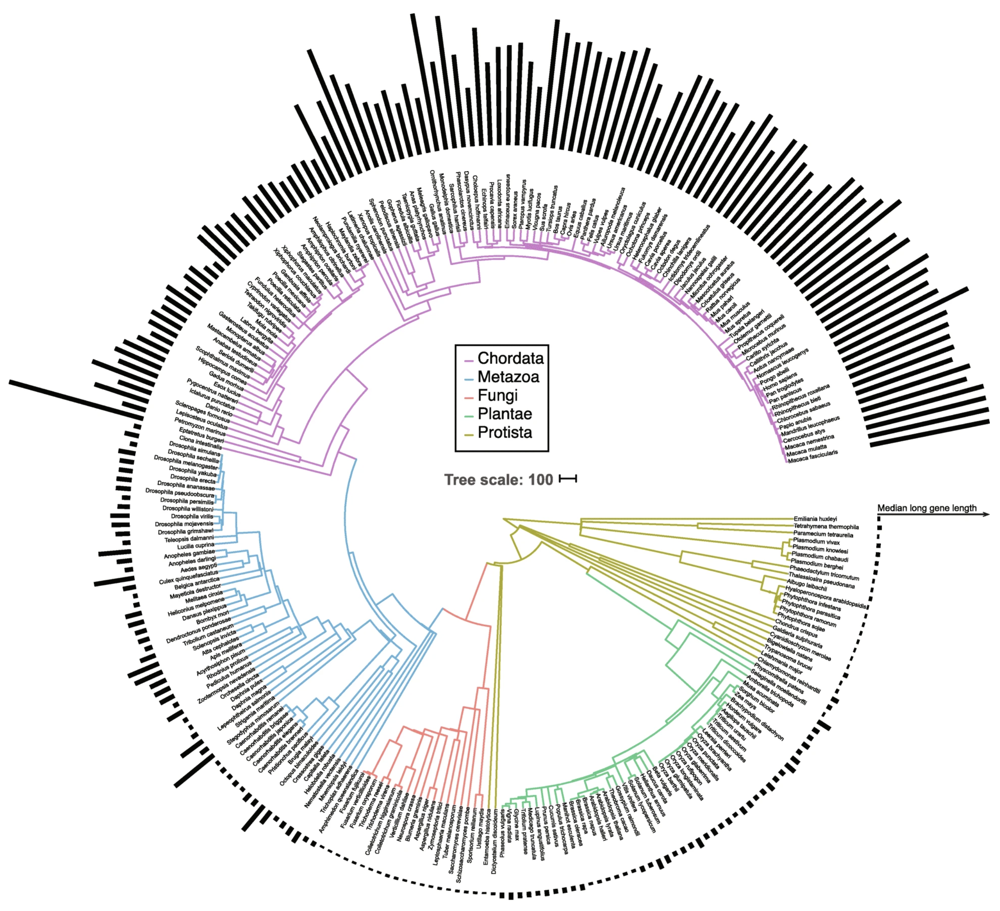
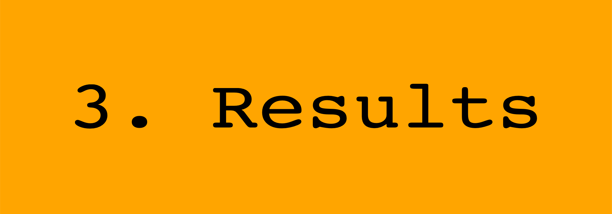

<style>

{width=21%}.main {
width: 36in;
height: calc(48in * 0.2);
position: absolute;
background-color: black;
color: #FFFF0090;
font-family: Comic Sans MS;
background-image: url("images/mosquitoe.png");
background-size: 30%, cover;
background-repeat: no-repeat, no-repeat;
}

#main-img-left {
 width: 40%;
}
#main-img-center {
 width: 10.3%;
}
#main-img-right {
 width: 14%;
}

.main p {
font-size: $if(main_textsize)$$main_textsize$$else$150px$endif$;
font-family: $if(main_fontfamily)$$main_fontfamily$$else$Special Elite$endif$;
text-align: $if(main_textalign)$$main_textalign$$else$center$endif$;
margin: 0;
position: absolute;
top: 50%;
-ms-transform: translateY(-50%);
transform: translateY(-50%);
margin-left: 0;
}

</style>

<center>Dylan Padilla$^1$, Liam Revell$^2$, & Michael Angilletta$^1$</center><br>
<center>$^1$School of Life Sciences, Arizona State University</center>
<center>$^2$Department of Biology, UMass Boston</center><br>
<center> `r icon_style(fontawesome("envelope", style = "solid"), scale = 1, fill = "gray")` <font size="12"> dpadil10@asu.edu </font> | `r icon_style(fontawesome("twitter", style = "brands"), scale = 1, fill = "skyblue")` <font size="6"> [Dylan_Padilla94]("https://twitter.com/Dylan_Padilla94")</font></center>

```{r, echo = FALSE, out.width = "60%", width = 7, height = 7, fig.align = "center", dpi = 300, include = FALSE}

library(DiagrammeR)
library(DiagrammeRsvg)
library(rsvg)

DiagrammeR::grViz("digraph {

graph [layout = dot, rankdir = LR, fontcolor = black, bgcolor = orange]

# define the global styles of the nodes. We can override these in box if we wish
node [shape = cds, style = filled, fillcolor = gray, color = orange, fontname = Courier]
edge [color = skyblue, fillcolor = skyblue]
data1 [label = '1. Background', shape = cds, fillcolor = orange, fontcolor = black]

# edge definitions with the node IDs
{data1}
}")%>% export_svg %>% charToRaw %>% rsvg_png("images/background.png", width = 2000, height = 700)

```

<center>
{width=32%}
{width=100%}
{width=85%}
{width=100%}

<font size="8">GCN provides genomic material for diversification and gene expansions or losses</font>

</center>

<center>

{width=90%}

<font size="8">Differential gene size expansion during animal evolution</font>

</center>


```{r, echo = FALSE, out.width = "60%", width = 7, height = 7, fig.align = "center", dpi = 300, include = FALSE}

DiagrammeR::grViz("digraph {

graph [layout = dot, rankdir = LR, fontcolor = black, bgcolor = orange]

# define the global styles of the nodes. We can override these in box if we wish
node [shape = cds, style = filled, fillcolor = gray, color = orange, fontname = Courier]
edge [color = skyblue, fillcolor = skyblue]
data1 [label = '2. Materials and Methods', shape = cds, fillcolor = orange, fontcolor = black]

# edge definitions with the node IDs
{data1}
}")%>% export_svg %>% charToRaw %>% rsvg_png("images/materials-methods.png", width = 2000, height = 300)

```

<center>
{width=60%}
</center>

<center>

{width=35%} <br> ⬇ <br> {width=15%}{width=25%} <br>RAxML version 8.0.0<br>  ⬇ <br>  {width=60%} <br>  {width=60%} <br> ⬇ <br> {width=40%} ➡ {width=21%}

</center>

```{r, echo = FALSE, out.width = "60%", width = 7, height = 7, fig.align = "center", dpi = 300, include = FALSE}

DiagrammeR::grViz("digraph {

graph [layout = dot, rankdir = LR, fontcolor = black, bgcolor = orange]

# define the global styles of the nodes. We can override these in box if we wish
node [shape = cds, style = filled, fillcolor = gray, color = orange, fontname = Courier]
edge [color = skyblue, fillcolor = skyblue]
data1 [label = '3. Results', shape = cds, fillcolor = orange, fontcolor = black]

# edge definitions with the node IDs
{data1}
}")%>% export_svg %>% charToRaw %>% rsvg_png("images/Results.png", width = 2000, height = 700)

```

<center>
{width=30%} <br>
<font size="8">Duplications = 41, Losses = 173</font>
{width=67%}
</center>
<center>
<font size="8">How do lifestyle and gene copy number correlate?</font>
</center>
<br>

```{r, echo = FALSE, out.width = "110%", width = 7, height = 7, fig.align = "left", dpi = 300}

plotTree(spp.tree.diptera, ftype = "off",  mar = c(0, 5, 0, 8), lwd = 2)


col1 <- c("black", "gold")
col2 <- viridisLite::viridis(n = 10)
xx <- as.factor(x[spp.tree.diptera$tip.label])
yy <- as.factor(y[spp.tree.diptera$tip.label])

h <- max(nodeHeights(spp.tree.diptera))
pp <- get("last_plot.phylo", envir =.PlotPhyloEnv)

for(i in 1:Ntip(spp.tree.diptera)){
    polygon(x = c(h, 1.12*h, 1.12*h, h), i+c(-0.5,-0.5,0.5,0.5),
            col = col1[as.numeric(as.factor(xx))[i]], border = "transparent")
    polygon(x = 6.5 + c(h, 1.12*h, 1.12*h, h), i+c(-0.5,-0.5,0.5,0.5),
            col = col2[as.numeric(as.factor(yy))[i]], border = "transparent")
}


levels(yy) <- levels(yy)[c(2, 3, 5, 4, 1)]

legend("topleft", legend = levels(xx), pch = 15, col = col1, bg = col1, bty = "n", title = "lifestyle", cex = 0.7)
legend(x = 40, y = 69, legend = levels(yy), pch = 15, col = col2, bg = col2, bty = "n", title = "copy number", cex = 0.7)

```
<center>
<font size="8">To address our research question, we fitted a custom Pagel94 model</font>
</center>

```{r, echo = FALSE, out.width = "115%", width = 7, height = 7, fig.align = "left", dpi = 300}


## Plotting transitions


plot(fit_xy, width = FALSE, color = TRUE, show.zeros = FALSE, text = FALSE, fit.signif = 2,
     mar = c(0, 0, 0, 0), spacer = 0.15, cex.traits = 0.7, max.lwd = 2.5)


```
<center>
<font size="8">We found that the gene copy number tends to increase in species known as pests</font>
</center>

```{r, echo = FALSE, out.width = "90%", width = 7, height = 7, fig.align = "center", dpi = 300}

library(lattice)
library(scales)

bar.data <- data.frame(count, gene.content, lifestyle, spp = names(gene.content))

bar.data$lifestyle <- as.factor(bar.data$lifestyle)


barplot(count ~ spp, data = bar.data, xaxt = "n", ylab = "Gene copy number", las = 1, xlab = "", border = FALSE, space = FALSE, col = c(alpha("black", 0.6), alpha("gold", 0.5))[bar.data$lifestyle], ylim = c(0, 5))

#for(i in 1:66){
#    axis(1, at = median(which(bar.data$spp == bar.data$spp[i])), labels = "")
#}
#text(x = 1:66, y = par("usr")[3] - 0.05, labels = bar.data$spp, xpd = NA, srt = 80, cex = 0.4, adj = 1.1)
mtext(side = 1, line = 2, text = "Species")

legend("topleft", legend = levels(bar.data$lifestyle), pch = 15, col = c("black", "gold"), bty = "n")

```
<center>
<font size="8">A custom Pagel94 model described the evolution between lifestyle and gene copy number better than the null model ($p=0.044$)</font> <br>
</center>
